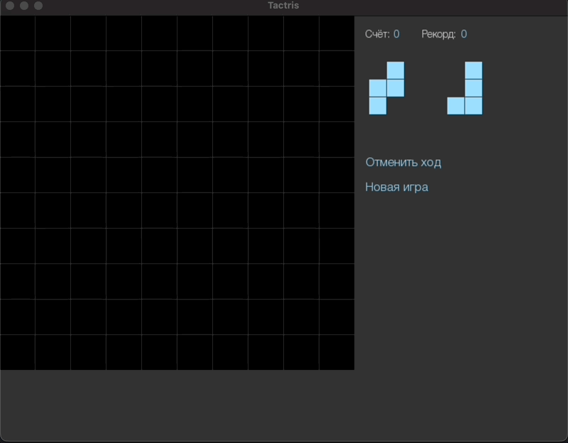

# py_tactris
Tactris game implementation on python

## Demo


## Installation
Assert you've got poetry installed on your machine, as well as all appropriate C libraries for pygame.
```bash
python3 -m venv .venv
source .venv/bin/activate
poetry install
```
## Run
```
python py_tactris/main.py
```
